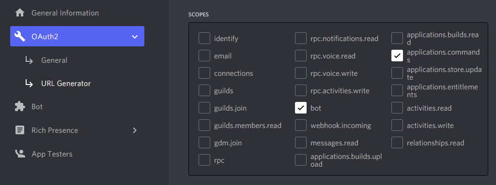

*Last updated: 15 Apr, 2022*

# Introduction
This bot was written mainly for the roleplaying community. It will generate an offline copy of all selected categories and individual channels.

The bot will generate a folder including some pre-written HTML5. Hosting this directory will recreate the logged channels with editable CSS and JS. All HTML, CSS, and JS files are written by Discord user @Firefly#7113.

This was tested in Firefox, Chrome, and Edge. Firefox has slightly better performance than Chrome, Chrome has slightly better aesthetics. Funnily enough, Edge has the best balance of performance and aesthetics.

## Testing
This is currently in something of an 'Early Access'. It functions, but there is a lot of room for improvement and it needs to be tested on a variety of servers. All questions and suggestions are fielded on the developer's [discord server](https://discord.gg/VZYKBptWFJ)!

## Preview
Left is the hosted copy, right is the original content in Discord App

## What You Can Do
* Clone, branch, or fork this repository and make any changes you want to it so long as proper credit is given to original code.
* Share your bot with friends in a private manner.

## What You Cannot Do (What I'd Prefer You Not Do)
* Profit off of this code or any bot that runs it.
* Publicly advertise your instance of this bot code as a service.
* Technically you can do this within the license, but it would be a bit rude :/

# How to Use the Bot
* This bot is intended for use **after your game has concluded**. It does *not* log in real time.
* Archiving image-heavy channels is highly discouraged.
* Due to the demanding nature of this bot, it is highly encouraged to use this only once your game is completed.
* You must have admin permissions in the server you want to copy.
* Discord limits how many things bot menus can display, so **your server cannot have more than 100 categories**. 

## Prerequisites
1. To run the bot, you will need Node.js version 17.4 or higher. You may download it for your operating system [here](https://nodejs.org).

2. To view the output, you will need a way to host the files. Hosting locally is straightforward with python. Mac and Linux users should already have python installed. All users may follow the instructions [here](https://developer.mozilla.org/en-US/docs/Learn/Common_questions/set_up_a_local_testing_server#running_a_simple_local_http_server).

## Linux/Mac/Windows
### Bot Application Setup
1. Follow the instructions to create a bot application [here](https://discordjs.guide/preparations/setting-up-a-bot-application.html). You will need the SERVER MEMBERS INTENT and the MESSAGE CONTENT INTENT enabled. 

2. Invite your bot to your server using the link generated in OAuth2 > URL Generator. You must at least check off `bot` and `applications.commands`. Be sure to grant proper permissions to view the message history of any channels you want to log, and if you have archived threads to log, that it can manage threads.

### Code Setup
3. Clone this github repository (or download it and unzip it somewhere).

4. Open a terminal (Command Prompt in Windows) and use `cd path/to/Roleplay-Archiver`

5. If you have properly installed Node.js, run `npm init` and accept the default suggestions.

6. Run `npm install`, which will install the dependencies listed in `package.json`.

7. In `config.json`, replace the token with the one on your bot's developer page. Reset it and copy the result

8. Enable Developer Mode if you don't have it. This allows you to obtain Discord IDs by right clicking on a user, server, channel etc. Developer Mode can be toggled in Settings > Advanced.

9. In `config.json`, Replace the clientID with your bot's application ID. Obtain this either from the General Information section on it's app page, or by right clicking on the bot's name in discord.

10. In `config.json`, replace the guildID with the server ID you want to run the bot in.

9. In your command line, run `npm test` to deploy the commands to the specified server. If this does not work, you may need to adjust the scripts in `package.json` from `nodejs <>` to `node <>`.

### Using the Bot
10. Run `npm start` to log the bot in.

11. In your server, use `/archive` in whichever channel you'd like to work in. Follow the prompts carefully. You will likely see four select boxes here to accomodate all categories. Progress will be displayed in your command line.

12. The command line will display 'finished' before you receive confirmation on discord. It is recommended to wait a moment or so in case any image files are still downloading.

13. If you would like to compress and downsize your images, use `/compress` in your server. If this crashes the bot, this is an error with the image processing module. I did not write this dependency and it is finicky. It usually works within 2-5 attempts, so you may restart the bot with `npm start` and use the `/compress` command until it works.

14. Use `/zip` to generate a zip file in the `output` folder. This is for convenience of distribution, and copies the necessary files to display the server log. Zipping the files will automatically clear the folder in `guild_caches` after about 30 seconds.

15. That is all. You may log the bot off with Ctrl+C. If you leave it running, your server will be on a cooldown to prevent abuse.

## How to View your Logs
For security reasons, you'll need to host the files locally (or on some other hosting service if you are savvy with that). This is most easily done with python. 

1. Virus scan the generated directory. It's safe, but don't take my word for it. Unzip it somewhere convenient and use `cd` in your command line to go there. You should see `index.html` when running `ls` (Linux/Max) or `dir` (Windows).

2. If you are on Mac or Linux, you should already have python. If you are on Windows, you may need to download it. All users can refer to instructions indicated in [Prerequisites](#Prerequisites).

3. Per the instructions, run `python -m http.server`

4. Go to `localhost:8000`, or whichever port number you specified if not the default. If this doesn't work, try `localhost:8000/index.html`.

5. When you are finished, press Ctrl+C in the command line to shut down the local server.

## Issues and Discrepancies
* Clearing your browser cache should fix any issues with css not updating or content that doesn't match that in its corresponding `messages.json` file.

  * Since this is fully offline, a lot of data gets loaded into your browser, so it is a good idea to clear your cache when you're finished anyway.

* Minor formatting discrepancies between original and generated messages.

* Custom emojis are handled, but it is possible that their removal from the server (or a server's deletion) will render them inaccessible.

* Does not indicate a message that has been replied to.

* Has issues with webhooks such as Tupperbox

## Future Updates
* Handle reactions maybe.
* Handle rich embeds.
* Need to test with Nitro sever pfps.
* Webook support